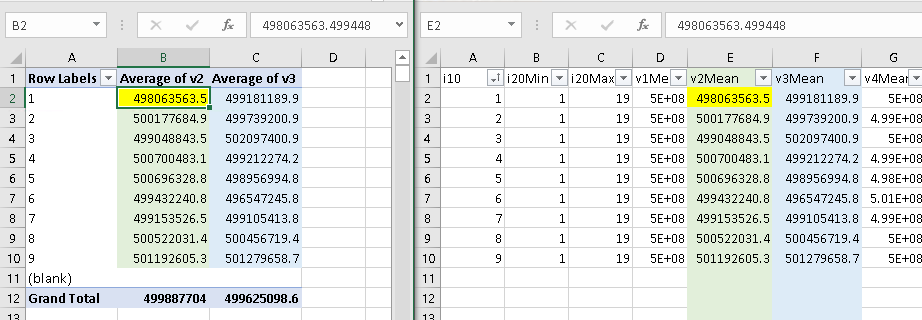

# netcore-csv

[](https://www.nuget.org/packages/netcore-csv/)

.NET core CSV

- [API](https://devel0.github.io/netcore-csv/api)
- [Changelog](https://github.com/devel0/netcore-util/commits/master)

<hr/>

<!-- TOC -->
* [Quickstart](#quickstart)
* [keynotes](#keynotes)
* [examples](#examples)
  + [example-01](#example-01)
  + [example-02](#example-02)
  + [example-03](#example-03)
* [other options](#other-options)
* [TODO](#todo)
* [How this project was built](#how-this-project-was-built)
<!-- TOCEND -->

<hr/>

## Quickstart

- create console project

```sh
dotnet new console -n example
cd example
```

- add reference to netcore-sci ( check latest version [here](https://www.nuget.org/packages/netcore-sci/) )

```sh
dotnet add package netcore-csv --version 0.1.0
```

if prefer to link source code directly to stepin with debugger add project reference instead

```sh
dotnet add reference path_to/netcore-csv/netcore-csv.csproj
```

for some useful sci extensions include [netcore-sci](https://github.com/devel0/netcore-sci#quickstart)

```
dotnet add package netcore-sci --version 1.26.0
```

- setup example code ( see [examples](examples) )

    - [example-01](examples/example-01) : first csv program
    - [example-02](examples/example-01) : linq to csv
    - [example-03](examples/example-01) : sci data

## keynotes

- reader requires a class type to describe field types
- writer can work directly from anonymous type ( see [example02](#example-02) )
- colum header can be overriden using `CsvHeader` property ( see [example3](#example-03) )

## examples

### example-01

```csharp
using SearchAThing.CSV;
using System.Linq;
using System.IO;

namespace example_01
{

    public enum TestEnum
    {
        unknown,
        enumA,
        enumB
    }

    public class MyData
    {
        public int intNr { get; set; }
        public string name { get; set; }
        public double val { get; set; }
        public TestEnum enumVal { get; set; }
    }

    class Program
    {
        static void Main(string[] args)
        {
            var pathfilename = "output.csv";

            using (var csv = new CsvWriter<MyData>(pathfilename))
            {
                csv.Push(new MyData
                {
                    intNr = 10,
                    name = "name1",
                    val = 11.2,
                    enumVal = TestEnum.enumA
                });
                csv.Push(new MyData
                {
                    intNr = 25,
                    name = "name2",
                    val = 13.4,
                    enumVal = TestEnum.enumB
                });
            }

            // append more
            using (var csv = new CsvWriter<MyData>(pathfilename, true))
            {
                csv.Push(new MyData
                {
                    intNr = 30,
                    name = "name3",
                    val = 44.5
                });
                csv.Push(new MyData
                {
                    intNr = 35,
                    name = "name4",
                    val = 33.2
                });
            }

            // read back data            
            System.Console.WriteLine(File.ReadAllText(pathfilename));            

            var q = new CsvReader<MyData>(pathfilename)
                .GroupBy(w => w.enumVal)
                .Select(w => new
                {
                    enType = w.Key,
                    sum = w.Sum(y => y.val),
                });

            foreach (var x in q)
            {
                System.Console.WriteLine($"enum:{x.enType} sum:{x.sum}");
            }
        }
    }
}
```

- output

```
"intNr","name","val","enumVal"
10,"name1",11.2,"enumA"
25,"name2",13.4,"enumB"
30,"name3",44.5,"unknown"
35,"name4",33.2,"unknown"

enum:enumA sum:11.2
enum:enumB sum:13.4
enum:unknown sum:77.7
```

### example-02

```csharp
using System.IO;
using System.Linq;
using SearchAThing;

namespace example_02
{
    class Program
    {
        static void Main(string[] args)
        {
            var pathfilename = "output.csv";

            new[] { 1, 2, 3 }.Select(w => new
            {
                str = $"string with val={w}",
                val = w
            }).ToCSV(pathfilename, new SearchAThing.CSV.CsvOptions()
            {
                PropNameToHeaderFunc = (propName) =>
                {
                    switch (propName)
                    {
                        case "val": return "Value";
                    }
                    return null;
                }
            });

            System.Console.WriteLine(File.ReadAllText(pathfilename));
        }
    }
}
```

output

```
"str","Value"
"string with val=1",1
"string with val=2",2
"string with val=3",3
```

### example-03

```csharp
using System;
using System.Linq;
using SearchAThing;
using System.Diagnostics;
using SearchAThing.CSV;
using System.Collections.Generic;

namespace test
{

    public enum TestEnum
    {
        atype,
        btype,
    }

    public class MyData
    {
        public int i10 { get; set; }
        public int i20 { get; set; }
        [CsvHeader("SomeStringCol")]
        public string s1 { get; set; }
        [CsvHeader("FirstDblCol")]
        public double v1 { get; set; }
        public double v2 { get; set; }
        public double v3 { get; set; }
        public double v4 { get; set; }
        public double v5 { get; set; }
        public double v6 { get; set; }
        public double v7 { get; set; }
        public double v8 { get; set; }
        public double v9 { get; set; }
        public double v10 { get; set; }
        public double v11 { get; set; }
        public double v12 { get; set; }
        public double v13 { get; set; }
        public double v14 { get; set; }
        public double v15 { get; set; }
        public double v16 { get; set; }
        public double v17 { get; set; }
        public double v18 { get; set; }
        public double v19 { get; set; }
        public double v20 { get; set; }
        [CsvColumnOrder(0)]
        public double firstcol { get; set; }
        public TestEnum envar { get; set; }
    }

    class Program
    {
        static void Main(string[] args)
        {
            const int CNT = 500000;
            {
                var stopw = new Stopwatch();
                stopw.Start();

                // <LangVersion>8.0</LangVersion>
                using var csv = new CsvWriter<MyData>("test.csv");

                var rnd = new Random();

                for (int i = 0; i < CNT; ++i)
                {
                    var d = new MyData
                    {
                        v1 = rnd.NextDouble() * 1e9,
                        v2 = rnd.NextDouble() * 1e9,
                        v3 = rnd.NextDouble() * 1e9,
                        v4 = rnd.NextDouble() * 1e9,
                        v5 = rnd.NextDouble() * 1e9,
                        v6 = rnd.NextDouble() * 1e9,
                        v7 = rnd.NextDouble() * 1e9,
                        v8 = rnd.NextDouble() * 1e9,
                        v9 = rnd.NextDouble() * 1e9,
                        v10 = rnd.NextDouble() * 1e9,
                        v11 = rnd.NextDouble() * 1e9,
                        v12 = rnd.NextDouble() * 1e9,
                        v13 = rnd.NextDouble() * 1e9,
                        v14 = rnd.NextDouble() * 1e9,
                        v15 = rnd.NextDouble() * 1e9,
                        v16 = rnd.NextDouble() * 1e9,
                        v17 = rnd.NextDouble() * 1e9,
                        v18 = rnd.NextDouble() * 1e9,
                        v19 = rnd.NextDouble() * 1e9,
                        v20 = rnd.NextDouble() * 1e9,
                        i10 = rnd.Next(1, 10),
                        i20 = rnd.Next(1, 20),
                        s1 = $"str:[{rnd.Next()}]",
                        envar = TestEnum.atype,
                    };

                    csv.Push(d);
                }

                System.Console.WriteLine($"written [{CNT}] rows in {stopw.Elapsed}");
            }

            {
                var stopw = new Stopwatch();
                stopw.Start();

                using var csv = new CsvReader<MyData>("test.csv");

                // optional custom header
                var customHeader = new Dictionary<string, string>();
                customHeader.Add("v3Mean", "v3Mean (Custom)");

                csv
                    .GroupBy(w => w.i10)
                    .Select(w => new
                    {
                        i10 = w.Key,
                        i20Min = w.Min(r => r.i20),
                        i20Max = w.Max(r => r.i20),
                        v1Mean = w.Select(w => w.v1).Mean(),
                        v2Mean = w.Select(w => w.v2).Mean(),
                        v3Mean = w.Select(w => w.v3).Mean(),
                        v4Mean = w.Select(w => w.v4).Mean(),
                        v5Mean = w.Select(w => w.v5).Mean(),
                        v6Mean = w.Select(w => w.v6).Mean(),
                        v7Mean = w.Select(w => w.v7).Mean(),
                        v8Mean = w.Select(w => w.v8).Mean(),
                        v9Mean = w.Select(w => w.v9).Mean(),
                        v10Mean = w.Select(w => w.v10).Mean(),
                        v11Mean = w.Select(w => w.v11).Mean(),
                        v12Mean = w.Select(w => w.v12).Mean(),
                        v13Mean = w.Select(w => w.v13).Mean(),
                        v14Mean = w.Select(w => w.v14).Mean(),
                        v15Mean = w.Select(w => w.v15).Mean(),
                        v16Mean = w.Select(w => w.v16).Mean(),
                        v17Mean = w.Select(w => w.v17).Mean(),
                        v18Mean = w.Select(w => w.v18).Mean(),
                        v20Mean = w.Select(w => w.v20).Mean(),
                    }).ToCSV("result.csv",
                    new CsvOptions() // optional
                    {
                        PropNameHeaderMapping = customHeader,
                        PropNameToHeaderFunc = (propname) =>
                            // <LangVersion>8.0</LangVersion>
                            propname switch
                            {
                                "v4Mean" => "v4Mean (Custom)",
                                _ => null,
                            }
                    });

                System.Console.WriteLine($"queried [{CNT}] rows in {stopw.Elapsed}");
            }
        }

    }

}
```

- output

```sh
devel0@main:/opensource/devel0/netcore-csv$ dotnet run -p examples/example-03
written [500000] rows in 00:00:17.7151366
queried [500000] rows in 00:00:13.8399370
```

- generated input data sample

```sh
devel0@main:/opensource/devel0/netcore-csv/example$ head -n 3 test.csv 
"firstcol","i10","i20","SomeStringCol","FirstDblCol","v2","v3","v4","v5","v6","v7","v8","v9","v10","v11","v12","v13","v14","v15","v16","v17","v18","v19","v20"
0,5,12,"str:[18129689]",867557696.4707849,109447404.32754503,62481810.83355183,10286359.12122501,16821376.52152282,246951585.75053865,40531692.57963621,128706280.20200239,94060354.9098877,773084326.5415562,605406319.0731249,24301973.182848644,275546743.6628168,993341022.6336405,332197053.51265013,897891412.4415683,393898102.63826424,75625031.75606254,141746737.59459832,923235933.7262976
0,7,8,"str:[715246488]",778737590.5452006,746023428.9737527,143709297.35885435,259873150.9688651,974400662.8051404,228502796.13793957,726555496.7925677,918882383.9271824,937200791.1732424,243253674.4714033,217995068.1598834,805125237.3518074,83740469.57294479,305738162.85735846,624054313.9279143,934975130.9188899,116701281.68384604,279470807.5371901,296962312.5609766,391285082.04188436
```

- generated linq query over input data

```sh
devel0@main:/opensource/devel0/netcore-csv/example$ head -n 3 result.csv 
"i10","i20Min","i20Max","v1Mean","v2Mean","v3Mean","v4Mean","v5Mean","v6Mean","v7Mean","v8Mean","v9Mean","v10Mean","v11Mean","v12Mean","v13Mean","v14Mean","v15Mean","v16Mean","v17Mean","v18Mean","v20Mean"
5,1,19,498744375.0046595,500696328.76969767,498956994.79407644,498347553.3321365,499105076.1419511,497968869.1339944,501762405.8354361,499745779.22874564,500889471.2232371,500183490.45615464,499631274.71673,499687046.22139966,500878450.76341426,499645752.7216835,501762614.12378675,500649710.9467961,501233924.9635705,498505682.329863,499466519.5720193
7,1,19,500261473.80103374,499153526.46980953,499105413.8423311,498641774.89563894,500344995.4115497,499545597.67373264,501381194.974964,499761652.26916814,500232888.6299126,500631700.19801253,500045648.5480878,502821365.214899,500142713.6305659,499689342.6614191,498776087.82817686,498683736.7473624,498262792.1616414,500554332.6785145,500256673.0652077
```

- `test.csv` is the input data created
- `result.csv` is a linq query over that data



## other options

to exclude some property from being serialized to/from csv use CsvIgnore attribute

## TODO

- thread safe support on write

## How this project was built

```sh
mkdir netcore-csv
cd netcore-csv

dotnet new sln
dotnet new classlib -n netcore-csv
dotnet new console -n examples

cd netcore-csv
dotnet add package netcore-util --version 1.0.6
cd ..

mkdir examples
cd examples
for i in 01 02 03; do
    dotnet new console -n example-$i
    cd example-$i
    dotnet add reference ../../netcore-csv
    cd ..
done
cd ..

dotnet sln netcore-csv.sln add netcore-csv
for i in 01 02 03; do dotnet sln netcore-csv.sln add examples/example-$i; done
dotnet build
```
